<font face="宋体">

<center>

# 人工智能原理与技术课程设计 project1

</center>

<center>

#### 2153067 王灏博

</center>

## 问题背景

> 问题的背景是吃豆人游戏，需要完成的目标分为使用不同的算法来找到目标的豆子，并且生成对应的路径。
> 这几种算法包括深度优先搜索(Depth First Search)、广度优先搜索(Breadth First Search)、
> 一致代价搜索(Uniform Cost Search)、和$ A^* $搜索(A Star Search)。
> 另外，需要对一些特定的问题构造状态空间、起始状态和目标状态，并完成一些函数来实现结点的扩展、
> 判断是否到达目标的方法(method)，另外，还需要完成一些启发式函数来匹配不同的问题。

## Question 1

### 问题概述

> 问题1需要完成的任务是使用深度优先搜索算法(Depth First Search)找到通往目标状态的路径，以及所有
> 展开过的结点。
> 需要注意的地方有以下几点(前4个问题)：
> a)对于一些问题，searchAgent已经完成了大部分的框架(比如问题的构建，移动的方式，子结点的展开方法)，
> 算法需要实现的内容就是完成一个动作序列来指导Agent来到达目的地。
> b)返回的这个动作序列必须是合法的(如，['A->C','C->G']，而不能是['A->C','D->G'])
> c)实验应当用到util.py中提供的一些数据结构，分别是栈(util.Stack)、队列(Queue)和优先队列(PriorityQueue)
> d)问题1的算法和其他三个搜索算法的写法应该是十分类似的，从代码上看只是数据结构有所差别。
> e)这个搜索算法不应当重复展开同一个结点。
> f)对于问题的状态空间，每一个状态是一个三元组的形式表示，即(结束状态,动作,代价)

### 算法设计

> 用栈(util.Stack)的数据结构，先把初始状态结点压入栈，进入以下循环，直到栈空：
> (1)弹出栈顶结点，检查其状态是否为目标状态，如果是，返回当前路径；如果不是，继续
> (2)如果弹出结点已经访问过，回到(1)，否则，找到弹出结点的successors，
> 按照已提供的函数的默认顺序将他们依次加在当前路径的尾部，然后依次将这些新路径压入栈
> (3)将刚才弹出结点加入到已访问结点
> 通过这样的循环找到了目标就直接在第(1)步返回了当前的路径，就完成了这个问题

### 算法实现

```py
def depthFirstSearch(problem: SearchProblem):
    "*** YOUR CODE HERE ***"
    from game import Directions
    currentState=problem.getStartState()
    visitedStates=set()
    currentPaths=util.Stack()
    currentPaths.push([(currentState,'startState',0)])
    if(problem.isGoalState(currentState)):
        return Directions.STOP
    while not currentPaths.isEmpty():
        path=currentPaths.pop()
        currentState=path[-1][0]
        if currentState in visitedStates:
            continue
        visitedStates.add(currentState)
        if(problem.isGoalState(currentState)):
            break
        currentSuccessors=problem.getSuccessors(currentState)
        for action in currentSuccessors:
            if action[0] in visitedStates:
                continue
            newPath=path[:]
            newPath.append(action)
            currentPaths.push(newPath)
    
    finalPath=[x[1] for x in path[1:]]
    return finalPath
    util.raiseNotDefined()

```

### 实验结果

#### 实验调试

> 实验过程中遇到的问题主要是语法错误，经常会将搞混什么时候用三元组列表，什么时候用三元组
> 通过解决这些问题，我对这次的问题结构有了更深刻的理解
> 下图为起始状态，注意要压栈一个含有初始状态的三元组列表，而不是一个三元组
> 
> 下图为将整个三元组连接到路径，而不是只连接动作
> 
> 下图为将路径的动作集合返回，但是不返回第一个，因为刚开始将初始状态压入栈，
> 所以第一个元素是初始状态，没有动作
> 

#### 实验完成


## Question 2

### 问题概述

> 问题2需要完成的任务是使用广度优先搜索算法(Breadth First Search)
> 找到通往目标状态的路径，以及所有展开过的结点。
> 需要注意的地方在第一题已经描述过，此处不再赘述。

### 算法设计

> 用队列(util.Queue)的数据结构，先把初始状态结点入队，进入以下循环，直到队空：
> (1)弹出队首结点，检查其状态是否为目标状态，如果是，返回当前路径；如果不是，继续
> (2)如果弹出结点已经访问过，回到(1)，否则，找到弹出结点的successors，
> 按照已提供的函数的默认顺序将他们依次加在当前路径的尾部，然后依次将这些新路径入队
> (3)将刚才弹出结点加入到已访问结点
> 通过这样的循环找到了目标就直接在第(1)步返回了当前的路径，就完成了这个问题

### 算法实现

```py
def breadthFirstSearch(problem: SearchProblem):
    """Search the shallowest nodes in the search tree first."""
    "*** YOUR CODE HERE ***"
    from game import Directions
    currentState=problem.getStartState()
    visitedStates=set()
    currentPaths=util.Queue()
    currentPaths.push([(currentState,'startState',0)])
    if(problem.isGoalState(currentState)):
        return Directions.STOP
    while not currentPaths.isEmpty():
        path=currentPaths.pop()
        currentState=path[-1][0]
        if currentState in visitedStates:
            continue
        visitedStates.add(currentState)
        if(problem.isGoalState(currentState)):
            break
        currentSuccessors=problem.getSuccessors(currentState)
        for action in currentSuccessors:
            if action[0] in visitedStates:
                continue
            newPath=path[:]
            newPath.append(action)
            currentPaths.push(newPath)
    finalPath=[x[1] for x in path[1:]]
    return finalPath
    util.raiseNotDefined()
```

### 实验结果

#### 实验调试

> 有了之前写深度优先搜索的经验，此次写广度优先算法只是将数据结构从Stack变成了Queue，即完成了这个问题

#### 实验完成


## Question 3

### 问题概述

> 问题3需要完成的任务是使用一致代价搜索算法(Uniform Cost Search)找到通往目标状态的路径，以及所有
> 展开过的结点。
> 需要注意的地方在第一题已经描述过，此处不再赘述。

### 算法设计

> 用优先队列(util.PriorityQueue)的数据结构，先把初始状态结点和默认初始代价0入队，
> 进入以下循环，直到队空：
> (1)弹出队首结点，检查其状态是否为目标状态，如果是，返回当前路径；如果不是，继续
> (2)如果弹出结点已经访问过，回到(1)，否则，找到弹出结点的successors，
> 按照已提供的函数的默认顺序将他们(包括已经历的实际代价与预估到终点的代价和)
> 依次加在当前路径的尾部，然后依次将这些新路径入队
> (3)将刚才弹出结点加入到已访问结点
> 通过这样的循环找到了目标就直接在第(1)步返回了当前的路径，就完成了这个问题

### 算法实现

```py
def uniformCostSearch(problem: SearchProblem):
    """Search the node of least total cost first."""
    "*** YOUR CODE HERE ***"
    from game import Directions
    currentState=problem.getStartState()
    visitedStates=set()
    currentPaths=util.PriorityQueue()
    currentPaths.push([(currentState,'startState',0)],0)
    if(problem.isGoalState(currentState)):
        return Directions.STOP
    while not currentPaths.isEmpty():
        path=currentPaths.pop()
        currentState=path[-1][0]
        if currentState in visitedStates:
            continue
        visitedStates.add(currentState)
        if(problem.isGoalState(currentState)):
            break
        currentActions=[x[1] for x in path[1:]]
        currentCost=problem.getCostOfActions(currentActions)
        currentSuccessors=problem.getSuccessors(currentState)
        for action in currentSuccessors:
            if action[0] in visitedStates:
                continue
            newPath=path[:]
            newPath.append(action)
            newCost=currentCost+action[2]
            currentPaths.push(newPath,newCost)
    finalPath=[x[1] for x in path[1:]]
    return finalPath
    util.raiseNotDefined()
```

### 实验结果

#### 实验调试

> 此次写一致代价搜索只是将广度优先算法的数据结构从Queue变成了PriorityQueue，
> 但是需要注意一点，就是需要在初始状态和后续添加
> 路径的时候同时将代价也一并添加进去，并且此处的代价是之前所有
> 动作的代价总和(如下图所示)，这样就完成了这个问题
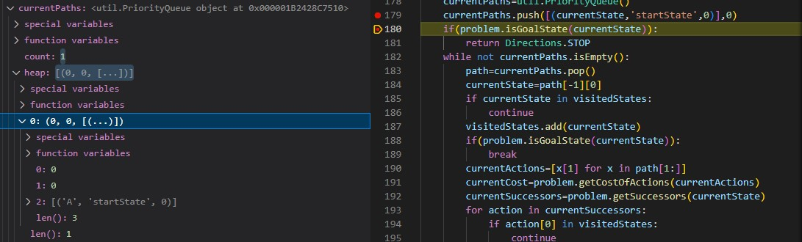

#### 实验完成


## Question 4

### 问题概述

> 问题4需要完成的任务是使用$ A^* $算法(A Star Search)找到通往目标状态的路径，以及所有
> 展开过的结点。
> 需要注意的地方在第一题已经描述过，此处不再赘述。

### 算法设计

> 用队列(util.PriorityQueue)的数据结构，先把初始状态结点和默认初始代价0入队，
> 进入以下循环，直到队空：
> (1)弹出队首结点，检查其状态是否为目标状态，如果是，返回当前路径；如果不是，继续
> (2)如果弹出结点已经访问过，回到(1)，否则，找到弹出结点的successors，
> 按照已提供的函数的默认顺序将他们(包括走过的代价和预估代价)
> 依次加在当前路径的尾部，然后依次将这些新路径入队
> (3)将刚才弹出结点加入到已访问结点
> 通过这样的循环找到了目标就直接在第(1)步返回了当前的路径，就完成了这个问题
> 另外，预估代价的启发式函数已经在传入参数时给出，不需要在本题考虑。

### 算法实现

```py
def aStarSearch(problem: SearchProblem, heuristic=nullHeuristic):
    """Search the node that has the lowest combined cost and heuristic first."""
    "*** YOUR CODE HERE ***"
    from game import Directions
    currentState=problem.getStartState()
    visitedStates=set()
    currentPaths=util.PriorityQueue()
    currentPaths.push([(currentState,'startState',0)],0)
    if(problem.isGoalState(currentState)):
        return Directions.STOP
    while not currentPaths.isEmpty():
        path=currentPaths.pop()
        currentState=path[-1][0]
        if currentState in visitedStates:
            continue
        visitedStates.add(currentState)
        if(problem.isGoalState(currentState)):
            break
        currentActions=[x[1] for x in path[1:]]
        currentCost=problem.getCostOfActions(currentActions)
        currentSuccessors=problem.getSuccessors(currentState)
        for action in currentSuccessors:
            if action[0] in visitedStates:
                continue
            newPath=path[:]
            newPath.append(action)
            newCost=currentCost+action[2]+heuristic(action[0],problem)
            currentPaths.push(newPath,newCost)
    finalPath=[x[1] for x in path[1:]]
    return finalPath
    util.raiseNotDefined()
```

### 实验结果

#### 实验调试

> 此次写$ A^* $搜索算法只是将一致代价搜索算法的数据结构没有变，
> 都是PriorityQueue，但是需要注意一点，就是需要在初始状态和后续添加
> 路径的时候同时将代价也一并添加进去，并且此处的代价是之前所有
> 动作的代价和预估代价总和(如下图所示)，这样就完成了这个问题
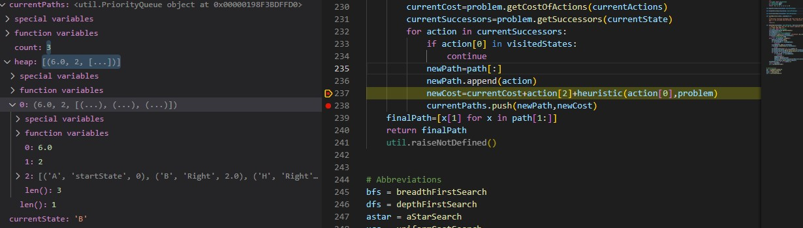

#### 实验完成


## Question 5

### 问题概述

> 问题5需要完成的任务是补全一个特定的问题，构造这个问题的状态空间，
> 即构造起始状态、终止状态以及返回每个结点的子结点的函数，通过构造
> 这样特定的问题理解search.py最上方的抽象类problem的运作原理，并
> 理解如何通过设计的这些算法来解决实际问题
> 其中大部分内容已经完成，需要填充的只有起始状态和终止状态，getSuccessors方法
> isGoalState方法，如果说search.py完成的是Agent的内容，那么从此问题
> 开始就是完成Agent的框架

### 算法设计

> 首先要理解题目的用意，需要完成角落问题的构建，整体问题是，
> 给出初始位置和四个角落的坐标，构造状态空间、结点展开方法、
> 判断是否完成任务方法
> 通过分析可知，对于每一个状态，他有一个坐标，以及4个角落
> 是否经历过(可以视作4个子任务)
> 显然，如果pacman在经历到一个角落时已经经历过其他所有角落
> 判断目标完成
> 
> 所以使用一个五元组来完成__init__方法
> (位置坐标,角落1是否被经历,角落2是否被经历,角落3是否被经历,角落4是否被经历)
> 来表示每个状态(如果用1表示经历过，0表示未经历过)
> 那么起始状态就是(起始坐标,0,0,0,0)，
> 结束状态集合就是{(角落1坐标,1,1,1,1),(角落2坐标,1,1,1,1),
> (角落3坐标,1,1,1,1),(角落4坐标,1,1,1,1)}
> 如下图所示
> 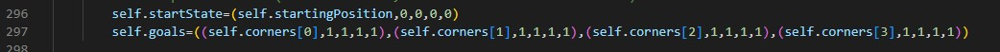
>
> getStartState方法和isGoalState方法也就可以很容易地完成
> 如下图所示
> 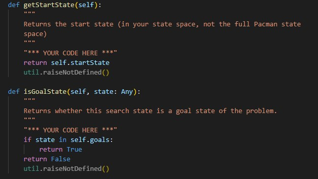
>
> 最后是getSuccessors方法
>
> 根据注释，我们可以看到作者已经很贴心地完成了是否撞墙的判断
> 以及下一步怎么走(通过这两个变量dx,dy)，
> 只需要考虑非撞墙情况下的变化
> 如果非撞墙，那么下一个坐标就是当前坐标加上改变量dx和dy
> 再判断下一个位置是不是角落，如果是任意一个角落，
> 将对应角落的值改为1，其他角落继承原来的状态
> 最后，由于是迷宫问题，每一步的代价都是1，所以设置单步代价
> 为1，构造一个三元组加入successors列表，返回这个列表
> 如下图所示
> 

### 算法实现

```py
class CornersProblem(search.SearchProblem):
    def __init__(self, startingGameState: pacman.GameState):
        """
        Stores the walls, pacman's starting position and corners.
        """
        self.walls = startingGameState.getWalls()
        self.startingPosition = startingGameState.getPacmanPosition()
        top, right = self.walls.height-2, self.walls.width-2
        self.corners = ((1,1), (1,top), (right, 1), (right, top))
        for corner in self.corners:
            if not startingGameState.hasFood(*corner):
                print('Warning: no food in corner ' + str(corner))
        self._expanded = 0 # DO NOT CHANGE; Number of search nodes expanded
        # Please add any code here which you would like to use
        # in initializing the problem
        "*** YOUR CODE HERE ***"
        #This tuple refers to (currentPosition, whether i th corner is visited)
        self.startState=(self.startingPosition,0,0,0,0)
        self.goals=((self.corners[0],1,1,1,1),(self.corners[1],1,1,1,1),(self.corners[2],1,1,1,1),(self.corners[3],1,1,1,1))

    def getStartState(self):
        """
        Returns the start state (in your state space, not the full Pacman state
        space)
        """
        "*** YOUR CODE HERE ***"
        return self.startState
        util.raiseNotDefined()

    def isGoalState(self, state: Any):
        """
        Returns whether this search state is a goal state of the problem.
        """
        "*** YOUR CODE HERE ***"
        if state in self.goals:
            return True
        return False
        util.raiseNotDefined()

    def getSuccessors(self, state: Any):
        """
        Returns successor states, the actions they require, and a cost of 1.

         As noted in search.py:
            For a given state, this should return a list of triples, (successor,
            action, stepCost), where 'successor' is a successor to the current
            state, 'action' is the action required to get there, and 'stepCost'
            is the incremental cost of expanding to that successor
        """

        successors = []
        for action in [Directions.NORTH, Directions.SOUTH, Directions.EAST, Directions.WEST]:
            # Add a successor state to the successor list if the action is legal
            # Here's a code snippet for figuring out whether a new position hits a wall:
            #   x,y = currentPosition
            #   dx, dy = Actions.directionToVector(action)
            #   nextx, nexty = int(x + dx), int(y + dy)
            #   hitsWall = self.walls[nextx][nexty]

            "*** YOUR CODE HERE ***"
            currentPosition=state[0] 
            x,y = currentPosition
            dx, dy = Actions.directionToVector(action)
            nextx, nexty = int(x + dx), int(y + dy)
            hitsWall = self.walls[nextx][nexty]
            if not hitsWall:
                nextPosition=(nextx,nexty)
                if nextPosition == self.corners[0]:
                    nextState=(nextPosition,1,state[2],state[3],state[4])
                elif nextPosition == self.corners[1]:
                    nextState=(nextPosition,state[1],1,state[3],state[4])
                elif nextPosition == self.corners[2]:
                    nextState=(nextPosition,state[1],state[2],1,state[4])
                elif nextPosition == self.corners[3]:
                    nextState=(nextPosition,state[1],state[2],state[3],1)
                else:
                    nextState=(nextPosition,state[1],state[2],state[3],state[4])
                costOfThisAction=1
                successors.append((nextState,action,costOfThisAction))

        self._expanded += 1 # DO NOT CHANGE
        return successors

    def getCostOfActions(self, actions):
        """
        Returns the cost of a particular sequence of actions.  If those actions
        include an illegal move, return 999999.  This is implemented for you.
        """
        if actions == None: return 999999
        x,y= self.startingPosition
        for action in actions:
            dx, dy = Actions.directionToVector(action)
            x, y = int(x + dx), int(y + dy)
            if self.walls[x][y]: return 999999
        return len(actions)

```

### 实验结果

#### 实验调试

> 因为是构造状态空间的问题，所以只需要想明白状态空间如何构造就可以
> 很容易地写出代码，唯一的问题就是在展开子结点的时候，
> 第一次写忽略了state作为一个五元组元素不可被更改的事情
> 所以导致语法错误，解决方法就是在初始化的时候赋一次值即可
> 如下图所示


#### 实验完成

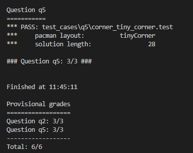

## Question 6

### 问题概述

> 问题6是对问题5的一个解决方案，问题5构造了一个角落问题
> 问题6需要用之前在问题4设计过的$ A^* $搜索算法来解决
> 问题5，但是缺少了启发式函数，那么本体的目标就是针对这
> 一问题设计一个启发式函数，来让$ A^* $搜索算法生效

### 算法设计

> 分析这样的一个角落问题，我们先考虑启发式函数的要求：
> (1)当前状态到目标状态代价的估计值$ \leqslant $实际到目标状态的代价
> (2)当前状态到目标状态代价的估计值$ \leqslant $
> 采取任意操作的实际代价+下一状态到目标状态代价的估计值
> 
> 经过一些思考后，发现<b>当前位置到所有未访问过的
> 角落的曼哈顿距离中最大的曼哈顿距离</b>比较符合
> 通过分析可知，无论往哪个方向走，到达未访问过
> 最远角落的曼哈顿距离最多减1，走一步代价也是1,
> 符合(2)
> 显然，到一个当前还未访问过的角落的曼哈顿距离
> 不大于走完所有角落的总代价，符合(1)
> 所以当前位置到所有未访问过的 角落的曼哈顿距离
> 中最大的曼哈顿距离估计比较接近实际距离

### 算法实现

```py
def cornersHeuristic(state: Any, problem: CornersProblem):
    corners = problem.corners # These are the corner coordinates
    walls = problem.walls # These are the walls of the maze, as a Grid (game.py)

    "*** YOUR CODE HERE ***"
    currentPosition=state[0]
    maxManhattanDistance=0
    for i in range(0,4):
        if state[i+1]==0:#judge whether the corner is visited
            goal=corners[i]
            manhattanDistanceTemp=abs(currentPosition[0]-goal[0])+abs(currentPosition[1]-goal[1])
            if manhattanDistanceTemp>maxManhattanDistance:
                maxManhattanDistance=manhattanDistanceTemp
    return maxManhattanDistance#The farest corner will finally be visited, so return the maximum of the distances
    return 0 # Default to trivial solution
```

### 实验结果

#### 实验调试

> 需要注意这个启发式函数要找的目标是<b>到所有未经历过
> 的角落的曼哈顿距离的最大值</b>，而不是所有角落，
> 一开始忽略了这一个问题，就导致多展开了许多节点
> 加入一个判断条件就可以避免这一问题
> 如下图所示
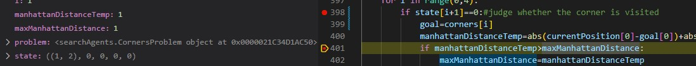

> 返回这些曼哈顿距离的最大值已经在刚才分析过，因为这样
> 最接近实际距离，所以可以展开更少的结点
> 另外，由于有可能一开始就是终点，也就是没有曼哈顿距离
> 可以被求，所以给曼哈顿距离赋初值0，以应对这一情况
> 其实也就是将默认情况统一合并在一起
> 如下图所示
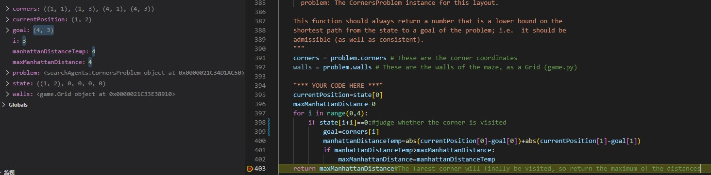

#### 实验完成

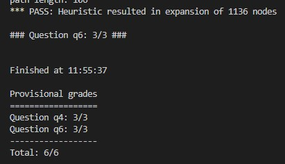

## Question 7

### 问题概述

> 问题7是一个新的类型的问题，要求吃到所有的豆子，
> 但是状态空间和问题5需要构建的初始化方法，展开结点方法，
> 判断目标方法和获取子结点方法已经写好，只需要完成
> 启发式函数的构建即可，与问题6类似，相当于进阶版

### 算法设计

> 与问题6类似，先分析启发式函数
> 分析这样的一个角落问题，我们先考虑启发式函数的要求：
> (1)当前状态到目标状态代价的估计值$ \leqslant $实际到目标状态的代价
> (2)当前状态到目标状态代价的估计值$ \leqslant $
> 采取任意操作的实际代价+下一状态到目标状态代价的估计值
> 
> 参考问题6，采用<b>当前位置到所有未访问过的
> 角落的曼哈顿距离中最大的曼哈顿距离</b>
> 符合(1)(2)
> 所以当前位置到所有未访问过的 角落的曼哈顿距离
> 中最大的曼哈顿距离估计比较接近实际距离
> 但是这种方式无法通过测试数据(分数只有3/4)
> 
> 需要考虑更优化的方法
> 
> 再次思考想到可以使用<b>相距最远的两个食物的曼哈顿距离
> 与当前位置到其中较近的一个食物的曼哈顿距离</b>作为
> 预估代价，这样同样可以符合上面的要求
> 同时更接近实际代价，也通过了测试(分数有4/4)
>
> 在后来阅读代码发现有提供mazeDistance方法
> 通过阅读明白，这种方法是先使用bfs走一遍，然后返回
> 代价，那么用这种方式获得的代价就是真实代价
> 所以是更优的一个策略，但是因为要多走一遍，会
> 多花费一些时间

### 算法实现

```py
def foodHeuristic(state: Tuple[Tuple, List[List]], problem: FoodSearchProblem):
    position, foodGrid = state
    maxManhattanDistance=0
    "*** YOUR CODE HERE ***"
    if len(foodGrid.asList())==0:
        return 0
    maxMazeDistance=0
    for food in foodGrid.asList():
        tempMazeDistance=mazeDistance(position,food,problem.startingGameState)
        if tempMazeDistance>maxMazeDistance:
            maxMazeDistance=tempMazeDistance
    return maxMazeDistance
```

### 实验结果

#### 实验调试

> 第一次使用最大曼哈顿距离的时候，最后一个测试节点
> 无法通过展开结点数过多，下图分别为代码和测试数据
> 通过新的思路解决了这个问题
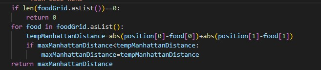
<br>


> 后来使用最远的两个食物的方法，通过了用例
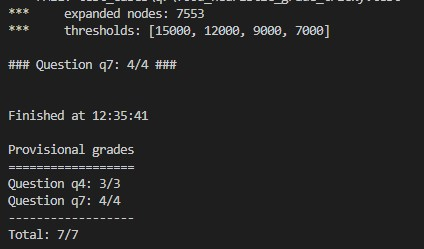

> 最后使用mazeDistance函数(也就是再用了一遍bfs)
> 完成了5/4

#### 实验完成

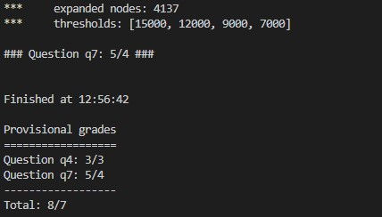

## Question 8

### 问题概述

> 问题8指出，虽然$ A^* $搜索算法配合很好的启发式函数
> 可以找到相对代价很小的路径，但是它无法通过所有点来找到
> 最短路径
> 本题需要使用一种搜索算法来完成对最近点的搜索(吃掉最近
> 的豆子)，并提示只需要很短的代码即可解决问题

### 算法设计

> 首先需要重新定义problem，如何每次都先去找到
> 距离最近的food呢？可以考虑使用bfs，因为bfs从状态所在
> 位置逐层扩散产生路径，距离最近的food一定最先被找到

### 算法实现

```py
class ClosestDotSearchAgent(SearchAgent):
    "Search for all food using a sequence of searches"
    def registerInitialState(self, state):
        self.actions = []
        currentState = state
        while(currentState.getFood().count() > 0):
            nextPathSegment = self.findPathToClosestDot(currentState) # The missing piece
            self.actions += nextPathSegment
            for action in nextPathSegment:
                legal = currentState.getLegalActions()
                if action not in legal:
                    t = (str(action), str(currentState))
                    raise Exception('findPathToClosestDot returned an illegal move: %s!\n%s' % t)
                currentState = currentState.generateSuccessor(0, action)
        self.actionIndex = 0
        print('Path found with cost %d.' % len(self.actions))

    def findPathToClosestDot(self, gameState: pacman.GameState):
        # Here are some useful elements of the startState
        startPosition = gameState.getPacmanPosition()
        food = gameState.getFood()
        walls = gameState.getWalls()
        problem = AnyFoodSearchProblem(gameState)

        "*** YOUR CODE HERE ***"
        return search.bfs(problem)
        util.raiseNotDefined()

class AnyFoodSearchProblem(PositionSearchProblem):
    def __init__(self, gameState):
        "Stores information from the gameState.  You don't need to change this."
        # Store the food for later reference
        self.food = gameState.getFood()

        # Store info for the PositionSearchProblem (no need to change this)
        self.walls = gameState.getWalls()
        self.startState = gameState.getPacmanPosition()
        self.costFn = lambda x: 1
        self._visited, self._visitedlist, self._expanded = {}, [], 0 # DO NOT CHANGE

    def isGoalState(self, state: Tuple[int, int]):
        x,y = state

        "*** YOUR CODE HERE ***"
        if (x,y) in self.food.asList():
            return True
        return False
        util.raiseNotDefined()

```

### 实验结果

#### 实验调试

> 考虑好解决方案后只用两行就可以完成代码的填充，所以一遍
> 就通过了测试，没有调试过程

#### 实验完成

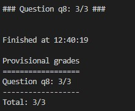

</font>