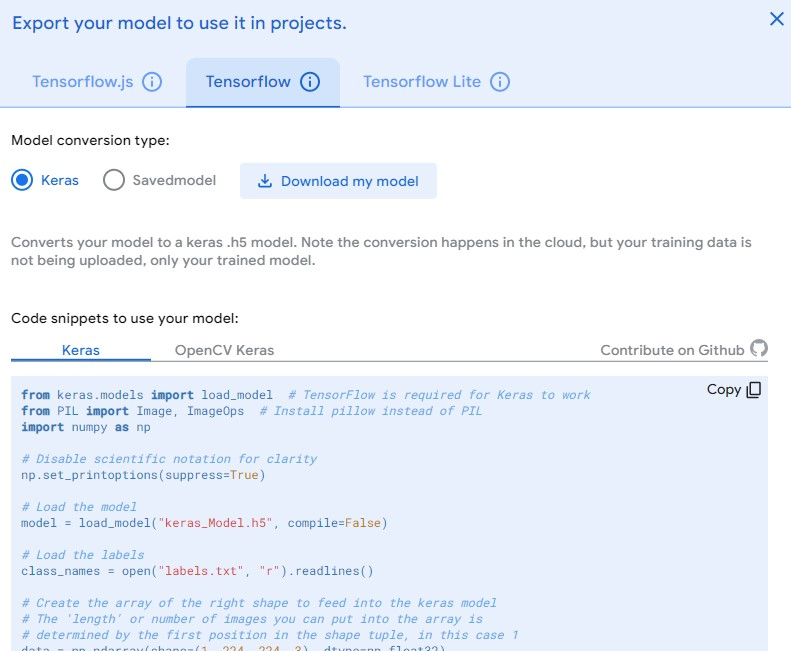

# 计算机视觉第一次作业

#### 2153067 王灏博

## **一、实验主题**

> 基于Google Teachable Machine 实现简单的电子设备识别

## **二、实验目的**

> 通过学习一定的相关知识，学习如何搭建计算机视觉需要用到的软件环境，以及使用Google Teachable Machine实现一些简单的物体识别，并将模型导出，在本地使用。

## **三、实验内容**

### **1、配置环境**

> 要实现本次实验以及后续可能需要完成的其他实验，配置好相应的软件环境至关重要。
> 根据Google Teachable Machine上提供的示例代码的注释了解到，要在本地运行已训练的模型，需要TensorFlow库的支持。
> TensorFlow是一个强大的机器学习框架，可以支持深度学习的各种算法，是目前最受欢迎的机器学习开源专案，很多大型电商使用的客服系统就是基于TensorFlow开发。

#### **1)建立虚拟环境**

> 为了防止和其他python版本和对应的库混用，用Anaconda建立一个新的虚拟python环境，如图：


>  再激活该环境： 


#### **2)安装TensorFlow**

> 在此处的python环境我们使用了python3.9，需要搭配TensorFlow2.5以正常使用。
> 使用pip指令安装，如图：


#### **3)安装OpenCV**

> 因为之后的测试样例常常用到OpenCV，一并将其配置到虚拟环境中，如图：


#### **4)测试安装完毕**

> 使用VSCode运行一段测试代码(代码如下)来测试是否已经安装完成TensorFlow和OpenCV：
```py
import tensorflow as tf
import cv2
print(tf)
print(cv2)
```


### **2、开始初步训练**

> 进入Teachable Machine后，点击开始使用，训练图片项目。
> 进入项目后，将分类分别命名成对应电子设备的名字，然后将webcam打开，分别采集每一种物品的样本图片，如图所示：

> 分类建立完成，并添加好样本后，开始训练模型。等待一段时间后，可以在网页上即时预览到自己的模型准确程度，如图所示：


### **3、导出模型到本地**
> 选择Export Model，选中TensorFlow，Download my model，将模型下载到本地。


> 然后把下面的代码复制到一个python源文件里，将这个源文件和刚才下载的模型放在同一目录下运行，即可对某张本地的图片进行识别，如图所示：


> 也就是说，我们已经成功将识别结果导出来了，现在我们就已经可以对它进行一些其他操作，比如，根据识别结果展示对应的图片，如图所示：


### **4、尝试数据增强**
> 通过实验，发现有时候会识别错误或者识别不到，考虑通过数据增强的方式，预处理原始数据，然后重新导入样本到训练模型。
> 预处理采用了PIL库中的各项函数来对某张图片进行修改(翻转、旋转等)，然后批量处理输出到新文件夹中，最后将样本重新导入到网站中重新训练。(代码附在报告结尾)
> 以下是经过数据增强后的样本文件夹(以左右翻转、耳机充电仓为例)：


> 重新训练模型后重复之前的实验，发现识别的精度有所提高。

```py
# 图像识别
from keras.models import load_model  # TensorFlow is required for Keras to work
from PIL import Image, ImageOps  # Install pillow instead of PIL
import numpy as np

# Disable scientific notation for clarity
np.set_printoptions(suppress=True)

# Load the model
model = load_model("keras_Model.h5", compile=False)

# Load the labels
class_names = open("labels.txt", "r").readlines()

# Create the array of the right shape to feed into the keras model
# The 'length' or number of images you can put into the array is
# determined by the first position in the shape tuple, in this case 1
data = np.ndarray(shape=(1, 224, 224, 3), dtype=np.float32)

# Replace this with the path to your image
image = Image.open(".\image\IMG_20230321_160416.jpg").convert("RGB")

# resizing the image to be at least 224x224 and then cropping from the center
size = (224, 224)
image = ImageOps.fit(image, size, Image.Resampling.LANCZOS)

# turn the image into a numpy array
image_array = np.asarray(image)

# Normalize the image
normalized_image_array = (image_array.astype(np.float32) / 127.5) - 1

# Load the image into the array
data[0] = normalized_image_array

# Predicts the model
prediction = model.predict(data)
index = np.argmax(prediction)
class_name = class_names[index]
confidence_score = prediction[0][index]

# Print prediction and confidence score
print("Class:", class_name[2:], end="")
print("Confidence Score:", confidence_score)

if index==0:
    imageRecognized=Image.open(".\image\earphoneCharger.jpg")
    imageRecognized.show()
    imageRecognized.close()
elif index==1:
    imageRecognized=Image.open(".\image\smartPhone.jpg")
    imageRecognized.show()
    imageRecognized.close()
elif index==2:
    imageRecognized=Image.open(".\image\charger.jpg")
    imageRecognized.show()
    imageRecognized.close()
elif index==3:
    imageRecognized=Image.open(".\image\mobileBattery.jpg")
    imageRecognized.show()
    imageRecognized.close()
else:
    imageRecognized=Image.open(".\image\\none.jpg")
    imageRecognized.show()
    imageRecognized.close()

```

```py
# 数据批量预处理
from PIL import Image
import os
import imageAugFunctions as iaf
if __name__ == '__main__':
    deviceClasses=['charger-samples','earphoneCharger-samples',
             'mobileBattery-samples','None-samples','smartphone-samples']
    for deviceClass in deviceClasses:
        path='D:\Grade II\Computer Vision\作业_源代码\imageSamples\\'+deviceClass
        filelist=os.listdir(path)

        path_all=[]
        for f in filelist:
            if f.endswith('.jpg'):
                path_all.append(os.path.join(path,f))
                
        pil_ims=[]
        for p in path_all:
            pil_ims.append(Image.open(p))
        print(len(pil_ims))
        counting=0
        savingPathRotation='.\imageAugmentedRotation\\'+deviceClass+'\\'
        savingPathGray='.\imageAugmentedGray\\'+deviceClass+'\\'
        savingPathFlipLR='.\imageAugmentedFlipLR\\'+deviceClass+'\\'
        savingPathFlipTB='.\imageAugmentedFlipTB\\'+deviceClass+'\\'

        for pilCurrent in pil_ims:
            iaf.Rotation(pilCurrent,counting,savingPathRotation,60)
            iaf.grayScaleConversion(pilCurrent,counting,savingPathGray)
            iaf.FlipLeftRight(pilCurrent,counting,savingPathFlipLR)
            iaf.FlipTopBottom(pilCurrent,counting,savingPathFlipTB)
            counting=counting+1

```

```py
# 数据批量预处理所用函数
from PIL import Image
import os
def Rotation(pilCurrent,index,path,angel):
    savingPath=path+(str)(index)+'.jpg'
    pilRotate=pilCurrent.rotate(angel)
    pilRotate.save(savingPath)
def grayScaleConversion(pilCurrent,index,path):
    savingPath=path+(str)(index)+'.jpg'
    pilRotate=pilCurrent.convert('L')
    pilRotate.save(savingPath)
def FlipLeftRight(pilCurrent,index,path):
    savingPath=path+(str)(index)+'.jpg'
    pilRotate=pilCurrent.transpose(Image.FLIP_LEFT_RIGHT)
    pilRotate.save(savingPath)
def FlipTopBottom(pilCurrent,index,path):
    savingPath=path+(str)(index)+'.jpg'
    pilRotate=pilCurrent.transpose(Image.FLIP_TOP_BOTTOM)
    pilRotate.save(savingPath)
```