# **第二次作业**

#### **2153067 王灏博**

## **3.1.1**

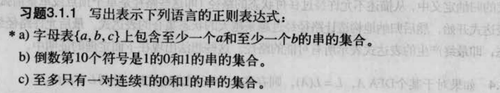

> a)正则表达式为 $ c^*(a(a+c)^*b+b(b+c)^*a)(a+b+c)^* $
> 
> b)正则表达式为 $ (0+1)^*1(0+1)^9 $
>
> c)正则表达式为 $ (10+0)^*(\epsilon+1+11)(0+01)^* $

## **3.1.3**

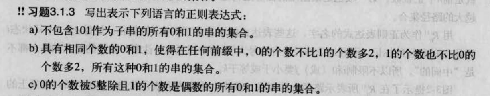

> a)正则表达式为 $ \epsilon+(0+11^*00)^*(\epsilon+11^*+11^*0) $
> 
> b)正则表达式为 $ (01+10)^* $
>
> c)正则表达式为 $ (00000+11+(01+10)(11)^*10000+(001+(01+10)(11)^*(0+101))(11)^*1000+(0001+(01+10)(11)^*1001+(001+(01+10)(11)^*(0+101))(11)^*(0+101))(11)^*100+(00001+(01+10)(11)^*10001+(001+(01+10)(11)^*(0+101))(11)^*1001+(0001+(01+10)(11)^*1001+(001+(01+10)(11)^*(0+101))(11)^*(0+101))(11)^*(0+101))(11+00(11)^*10001+00(11)^*(0+101)(11)^*1001+(00(11)^*1001+00(11)^*(0+101)(11)^*(0+101))(11)^*(0+101))^*(10+01+00(11)^*10000+00(11)^*(0+101)(11)^*1000+(00(11)^*1001+00(11)^*(0+101)(11)^*(0+101))(11)^*100))^* $

## **3.1.4**

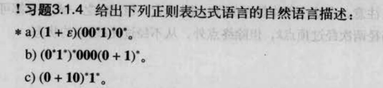

> a)自然语言描述为：不包含相邻的1的0和1的串的集合
> 
> b)自然语言描述为：包含子串000的串的集合
>
> c)自然语言描述为：要么没有连续的1的子串，要么存在一个连续的1的子串，并且这个连续的1的串后没有任何的0的串的集合

## **3.2.4**

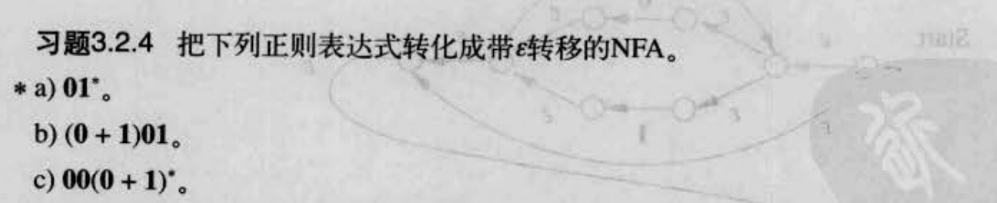

> a)
> 
>
> b)
> 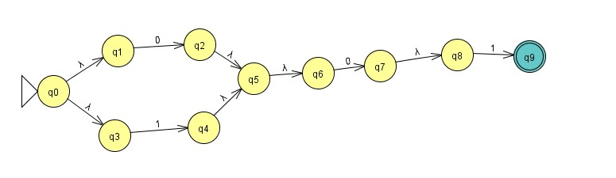
>
> c)
> 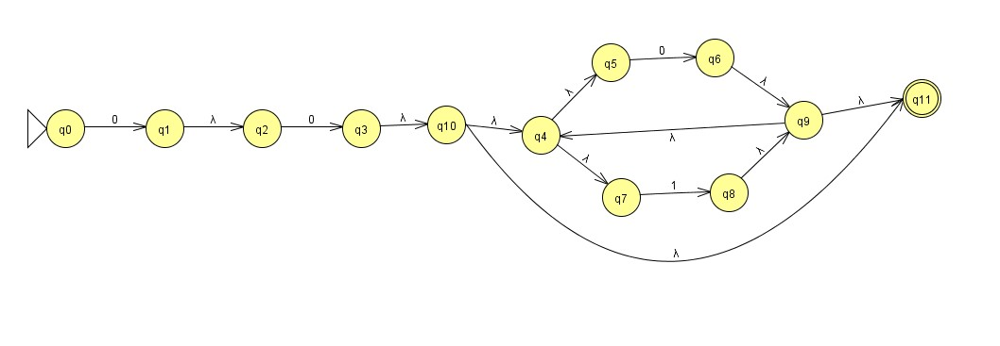

## **3.2.6(1)**

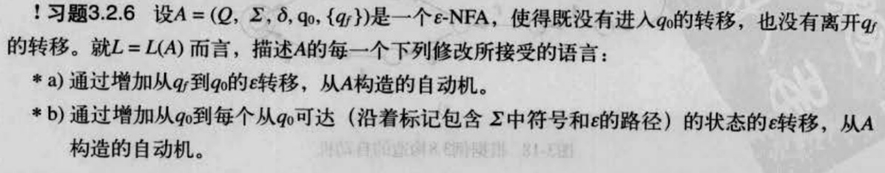

> a)接受的语言是 $ L^+ $
> 
> b)接受的语言是 $ L $ 的所有后缀的集合(包括L本身)

## **3.2.6(2)**

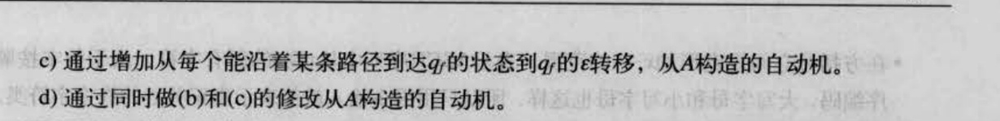

> c)接受的语言是 $ L $ 的所有前缀的集合(包括L本身)
> 
> d)接受的语言是 $ L $ 的所有前缀和后缀的集合(包括L本身)

## **3.2.7**

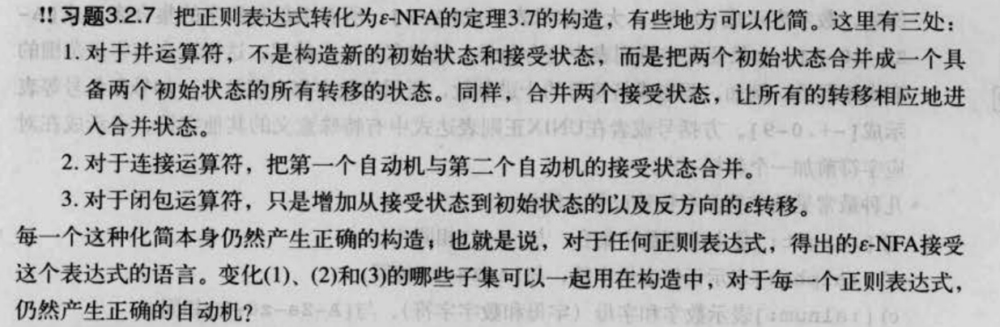

> 变化(1),(2),(3)组成集合{(1),(2),(3)}这个集合的子集
> {},
> {(1)},
> {(2)},
> {(3)},
> {(1),(2)},
> {(1),(3)}
> 可以用于构造中而产生正确的$ \epsilon-NFA $自动机

## **3.2.8**

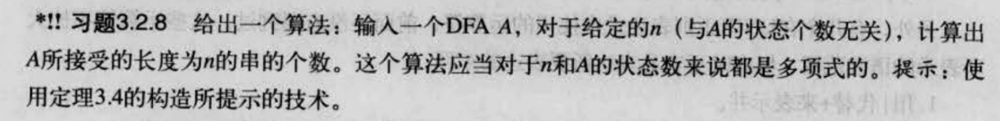

> 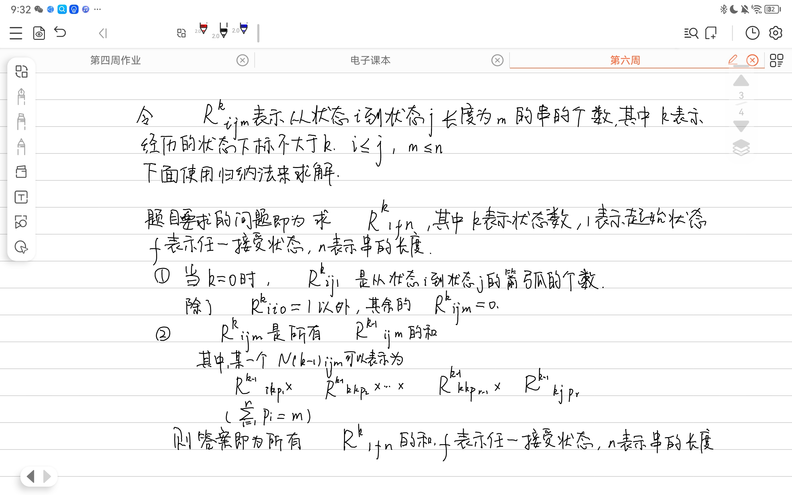

## **3.3.1和3.3.2**

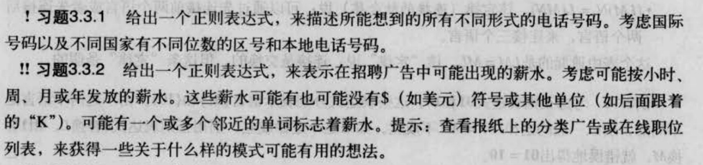

> 3.3.1
> 根据资料显示合法的区号由最多三位数字组成，
> 其中第一位是除了0以外的九个数字的任意一个
> 合法的总长度(不包括'+')为[8,15]中的一个整数
> 设$ \sum_a $ ={0,1,2,3,4,5,6,7,8,9}
> 设$ \sum_b $ ={1,2,3,4,5,6,7,8,9}
> 所以匹配所有国家手机号码的正则表达式为：
> $ '+'(\sum_b)((\sum_a)^7+(\sum_a)^8+(\sum_a)^9+(\sum_a)^{10}+(\sum_a)^{11}+(\sum_a)^{12}+(\sum_a)^{13}+(\sum_a)^{14}) $
>
> 3.3.2
> 从一些招聘网站上获得的招聘信息如图所示
> 
>  
> 
>  
> 
>  
> 根据这些信息，尝试构造一个正则表达式来尽可能涵盖多的薪资：
> 设$ \sum_a $ ={0,1,2,3,4,5,6,7,8,9}
> 设$ \sum_b $ ={1,2,3,4,5,6,7,8,9}
> $ (\epsilon+'Up~to~')(\epsilon+'\$')((\sum_b((\sum_a)^{3}+(\sum_a)^{4}+(\sum_a)^{5})'-'\sum_b((\sum_a)^{3}+(\sum_a)^{4}+(\sum_a)^{5})'a~month')+('From~'\sum_b\sum_a)'an~hour') $